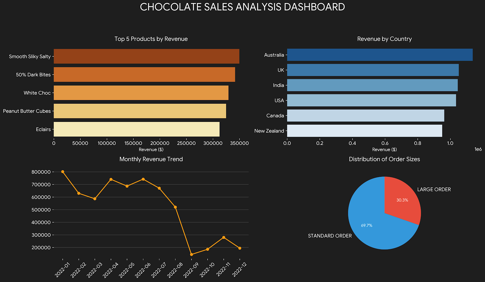

# Excel: Global Chocolate Sales Analysis

## Overview
This project is an end-to-end data analysis of global chocolate sales performance, executed entirely within Microsoft Excel. The objective was to clean raw transactional data, analyze regional and product-level performance, and construct an interactive dashboard to surface key business insights.

## Project Files
* **`chocolate sales.xlsx - Chocolate Sales.csv`**: The raw, uncleaned transactional data.
* **`Chocolate_Sales_Analysis.xlsx`**: The finalized workbook containing data modeling (Excel Tables), aggregations (Pivot Tables), and the interactive dashboard.

## Key Insights
By leveraging Pivot Tables and dynamic visualizations, the analysis revealed the following:
* **Top Performing Product:** Smooth Silky Salty
* **Highest Revenue Markets:** Australia, UK, and India
* **Peak Sales Period:** January (Highest monthly volume)
* **Order Distribution:** ~70% of transactions are Standard Orders, while ~30% are Large Orders.

## Technical Skills Applied
* **Microsoft Excel** (Data Cleaning & Formatting)
* **Pivot Tables & PivotCharts** (Aggregation & Trend Analysis)
* **Interactive Dashboards** (Slicers & Dynamic Visualizations)
